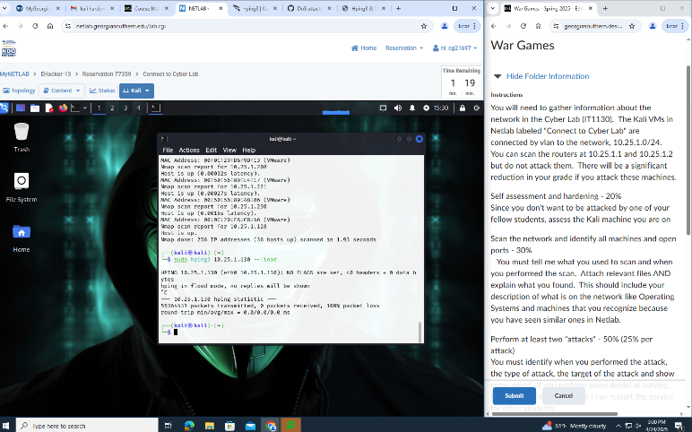
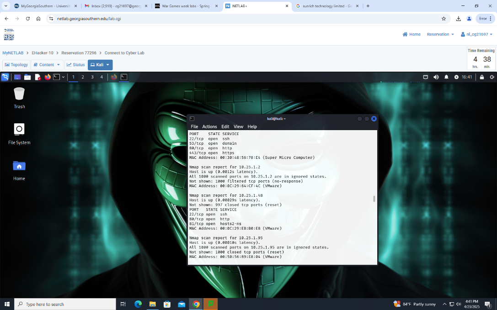
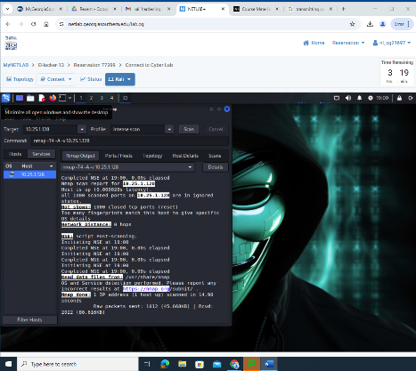
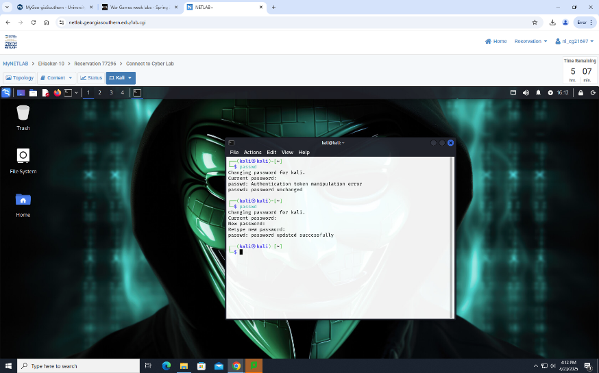
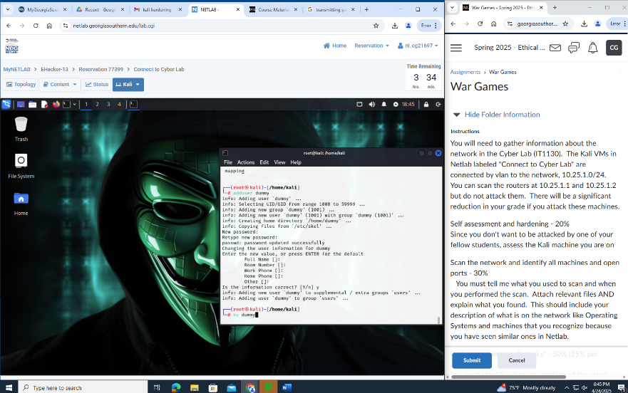

# Ethical Hacking Lab – Network Scanning, System Hardening & DoS Simulation

This project documents a cybersecurity lab completed at Georgia Southern University (Spring 2025). The lab involved performing system hardening, conducting internal network scanning using Nmap and Zenmap, and simulating a Denial-of-Service (DoS) attack using hping3 — all within a controlled virtual lab environment.

---

## 🛠️ Tools Used

- **Zenmap / Nmap** – Network scanning and port discovery
- **hping3** – DoS simulation using packet flood
- **Linux CLI** – Host-based hardening and scanning tasks

---

## 🔐 System Hardening & Self-Assessment

- Performed a host-based vulnerability scan using Zenmap. The scan returned all ports in an ignored state, suggesting that the system was already protected by default firewall settings.
- Implemented host hardening by:
  - Updating the default user password to a unique, secure value.
  - Creating a non-privileged dummy user account to apply the **principle of least privilege**, minimizing risk when performing system-level operations.

---

## 🌐 Network Scanning and Host Identification

- Scanned the `10.25.1.0/24` subnet using Nmap on E-Hacker-10 at 4:41 PM, April 23, 2025.
- Identified IP addresses, MAC addresses, open ports, and vendor information.
- Found that most devices were associated with **VMware** (likely student VMs).
- Detected additional systems including:
  - **Super Micro Computer Inc.** – Likely core router or server
  - **Sunrich Technology Limited** – Possibly OEM hardware
  - **Proxmox Server Solutions GmbH** – Likely virtualization hosts (PVE)

---

## 💥 Denial-of-Service (DoS) Attack Simulation

- Conducted a DoS simulation using `hping3` in **flood mode** on E-Hacker-13 at 3:23 PM, April 24, 2025.
- Targeted a virtual machine at `10.25.1.130`.
- Let the simulation run for ~7 minutes, transmitting over **55 million packets**.
- Captured screenshots before and after the attack to document transmission metrics and visual confirmation of activity.

---

## 📸 Screenshots

**DoS Simulation Start**  

**DoS Simulation End**  

**Network Scanning**

**Self Assesment**

**Password Change**

**Non Privileged User Account Creation**

---

## 📁 Repository Contents

cybersecurity-lab-project/
├── README.md
├── Wargames.docx               # Original lab write-up
├── screenshots/
│   ├── dos_start.png
│   └── dos_stop.png
